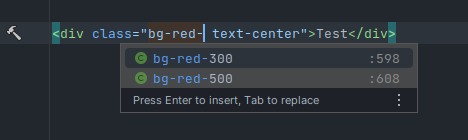

# dotnet-vsa-tailwind-rider

## Usage / repro

### Install

```bash
cd src/TailwindVSA
dotnet restore
yarn
libman restore
```

### Hot reload changes using tailwind 

```bash
cd src/TailwindVSA
yarn watch
```

### Change Tailwind classes / repro

Edit `Features/Home/Index.cshtml`

Tailwind Plugin doesn't show color preview/suggestions (suggestion in screenshot only works because class already exists)



However, Tailwind watcher immediately rebuilds and includes everything as expected.